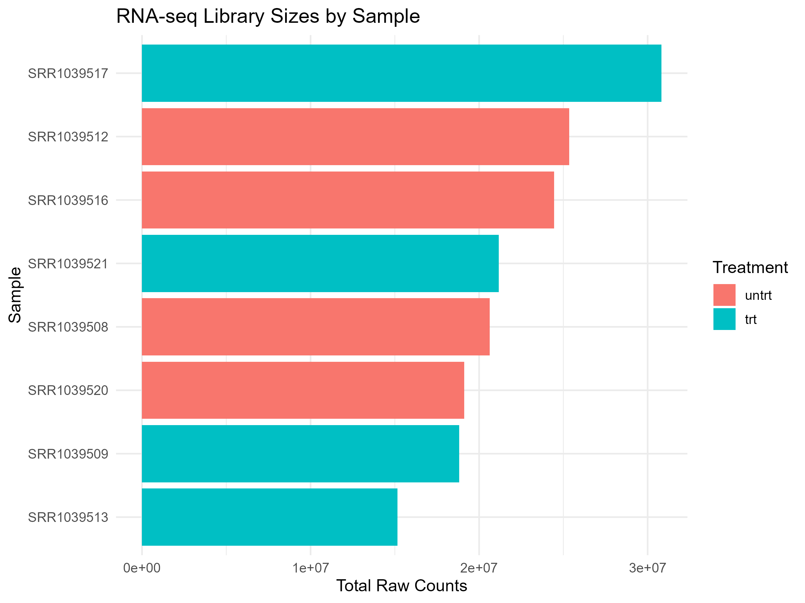
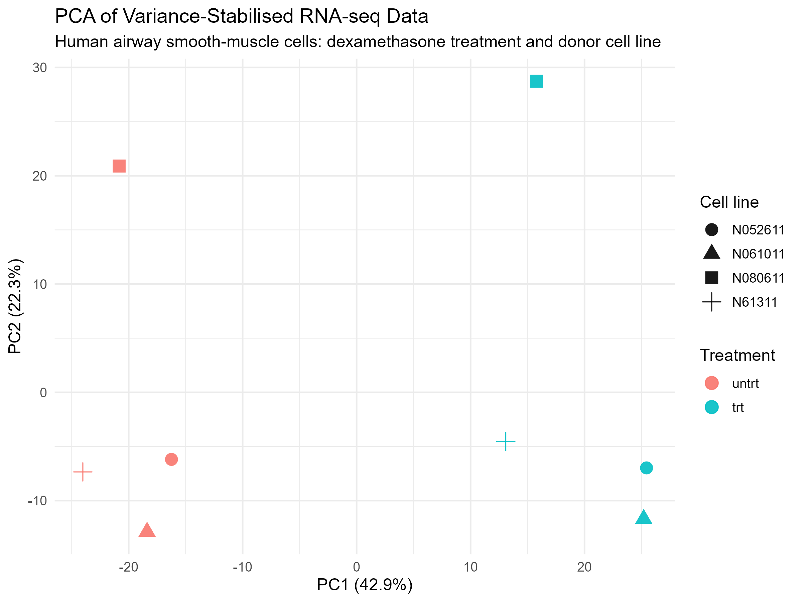
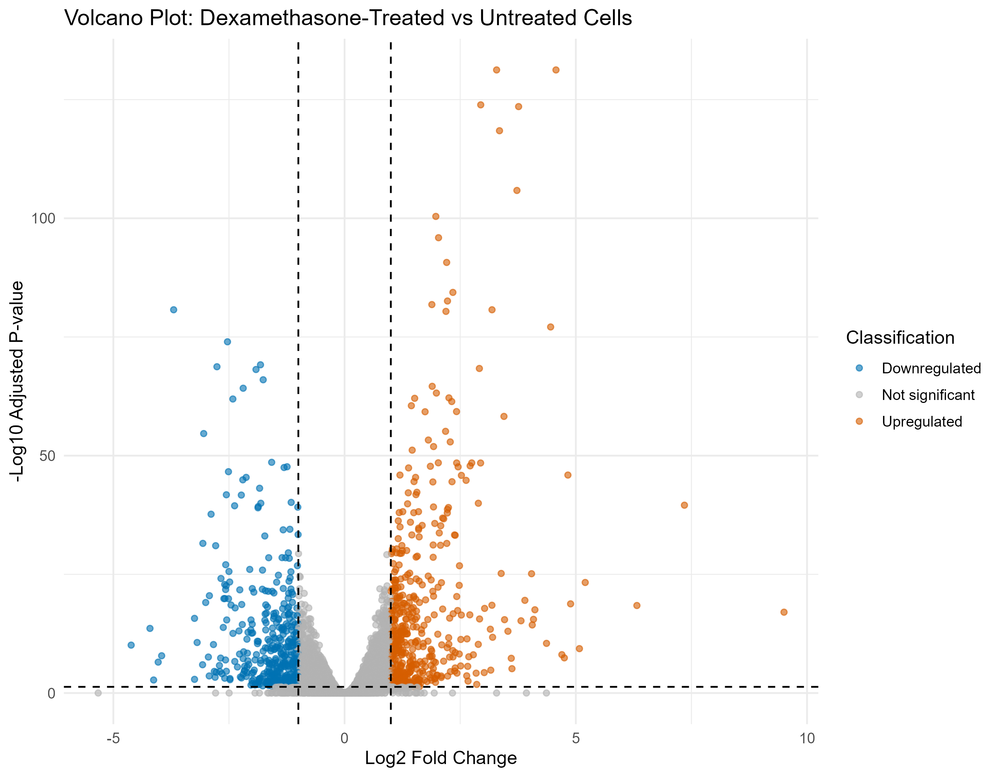
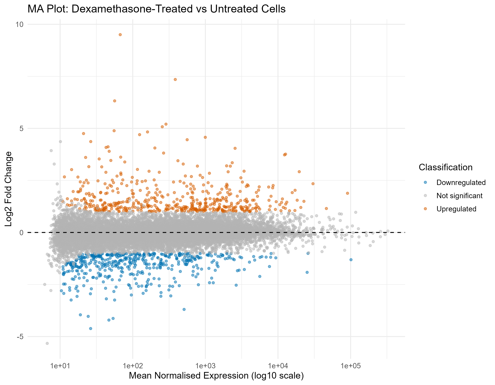
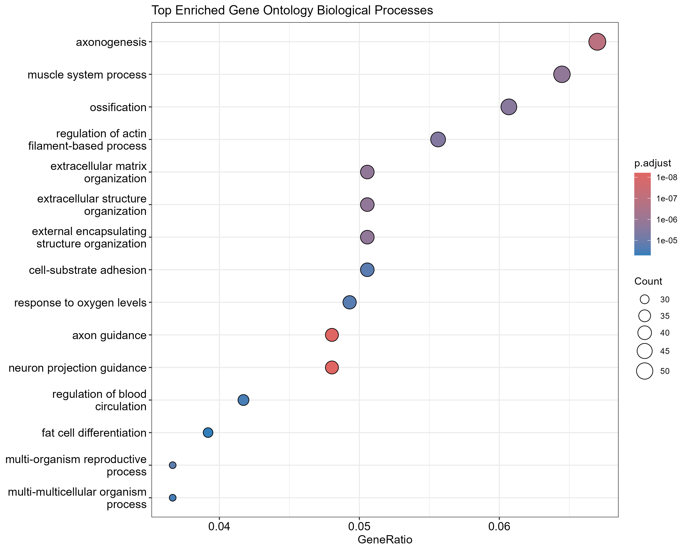

## Project objective 
 
This educational analysis evaluates transcriptomic differences between dexamethasone-treated and untreated primary human airway smooth-muscle cells using public bulk RNA-seq data. 
 
## Dataset and experimental design 
 
The `airway` Bioconductor dataset contains RNA-seq count data from eight samples across four donor cell lines. Each donor cell line includes one untreated and one dexamethasone-treated sample. 
 
The analysis used the DESeq2 design: 
 
`~ cell + dex` 
 
This accounts for donor cell line while testing treatment-associated differences. 
 
## Data preparation and quality control 
 
Genes with fewer than 10 counts in at least four samples were removed before analysis. This retained 16,139 of 63,677 genes. 
 
### Library sizes 

 
Library sizes ranged from approximately 15.2 million to 30.8 million raw counts. DESeq2 normalisation was used to account for differences in sequencing depth. 
 
## Principal Component Analysis 
 
Variance-stabilising transformation was applied before PCA. 

 
PC1 explained 42.9% of total variation and PC2 explained 22.3%. The plot showed broad separation between untreated and dexamethasone-treated samples along PC1, with additional variation associated with donor cell line. 
 
## Differential-expression analysis 
 
After accounting for donor cell line, DESeq2 tested 16,139 genes between dexamethasone-treated and untreated samples. 
 
- Significant genes: 951 
- Upregulated after treatment: 490 
- Downregulated after treatment: 461 
 
Significance was defined as adjusted *p* < 0.05 and absolute log2 fold change ≥ 1. 
 
### Volcano plot 

 
### MA plot 

 
Most genes were centred around zero log2 fold change, while a subset met the predefined adjusted *p*-value and fold-change thresholds. 
 
## Gene Ontology enrichment 
 
Gene Ontology Biological Process enrichment was performed using genes meeting the differential-expression thresholds. 

 
Enriched terms included extracellular-matrix organisation, muscle-system processes, actin-filament regulation and signalling-related processes. These findings are exploratory and do not establish causal mechanisms. 
 
## Heatmap of top differentially expressed genes 

 
The heatmap broadly separated untreated and treated samples. Colours represent row-scaled expression values, showing relative rather than absolute expression for each gene. 
 
## Limitations 
 
This analysis uses a small public dataset with eight samples from four donor cell lines. Results are exploratory, and Gene Ontology terms are annotation-based. Findings should not be interpreted as clinical evidence or proof of biological causality. 
 
## Conclusion 
 
This project demonstrates an end-to-end bulk RNA-seq workflow using R and Bioconductor: count-data preparation, quality control, DESeq2 normalisation, PCA, differential-expression analysis, Gene Ontology enrichment and heatmap visualisation.

---

## 
